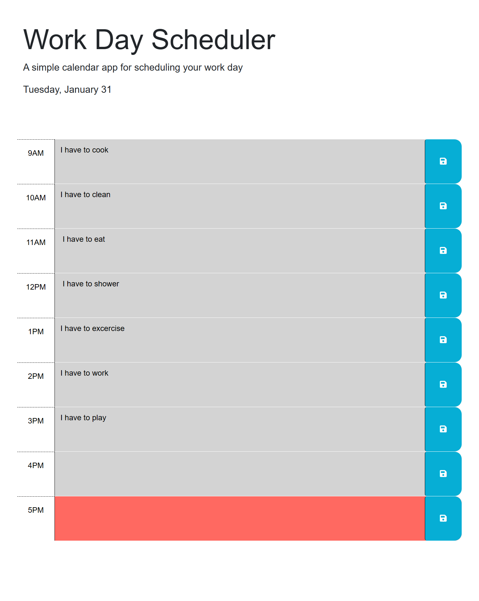
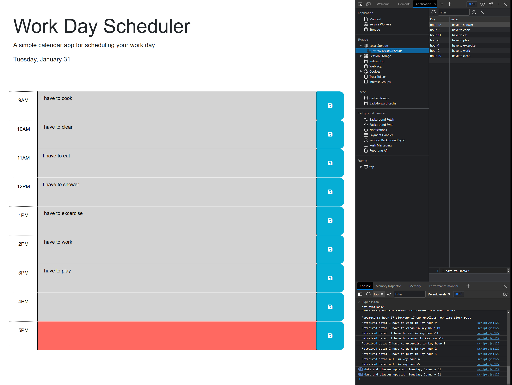

# 5-Work-Day-Scheduler
Schedule your work day with this simple, easy to use work scheduler!

## Description
Type the activity you desire to schedule within the hour block. Save it for later use. Upon re-launch of the application, the saved activities will be displayed.

## Accessing the Application
The application can be accessed on the GitHub repo here: https://github.com/cristino4/5-work-day-scheduler/

The application is also available on its published site: https://cristino4.github.io/5-work-day-scheduler/

To run the application locally, download the applications files and open the index.html file on any web browser.

## Screenshot of the application

